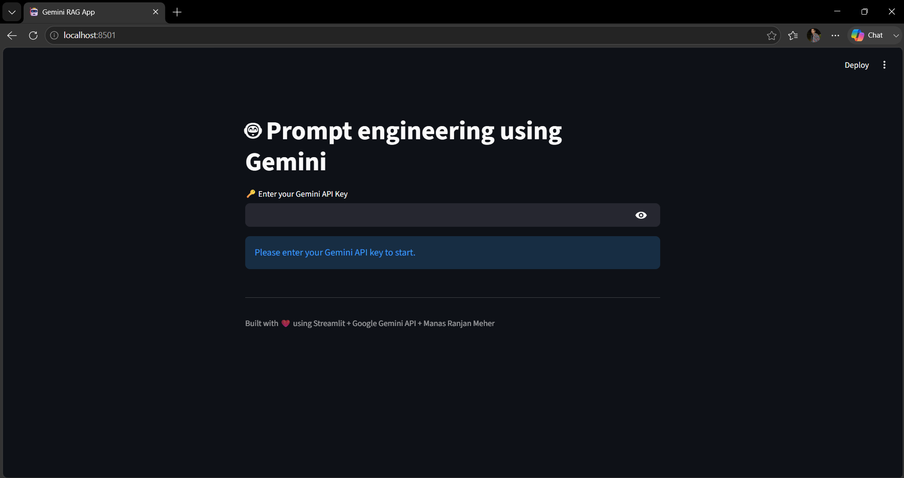

# 🤖 Prompt Engineering using Google Gemini

A simple Streamlit application demonstrating **Prompt Engineering** using the **Google Gemini API**.

The application accepts a user prompt, enhances it with additional instructions (prompt augmentation), and generates intelligent AI responses using Google's Gemini model.

This project is ideal for beginners learning Prompt Engineering and Generative AI with Streamlit.

---

## 🚀 Features

- 🔑 Gemini API Key Authentication
- 💬 Interactive Chat Interface
- 🤖 Google Gemini Integration
- 🧠 Prompt Augmentation
- 🎨 Clean Streamlit UI
- ⚡ Fast AI Responses
- 📚 Beginner Friendly

---

## 🛠️ Tech Stack

- Python
- Streamlit
- Google Gemini API
- Prompt Engineering

---

## 📂 Project Structure

```
Prompt-Engineering-Gemini/
│
├── gemini_prompt.py
├── requirements.txt
├── README.md
└── screenshots/
    └── home.png
```

---

## ⚙️ Installation

### Clone the Repository

```bash
git clone https://github.com/manasranjanmeher99/Prompt-Engineering-Gemini.git

cd Prompt-Engineering-Gemini
```

---

### Create Virtual Environment

Windows

```bash
python -m venv .venv

.venv\Scripts\activate
```

Linux / macOS

```bash
python3 -m venv .venv

source .venv/bin/activate
```

---

### Install Dependencies

```bash
pip install -r requirements.txt
```

---

## 📦 Requirements

```
streamlit
google-generativeai
```

---

## 🔑 Get a Gemini API Key

1. Visit Google AI Studio

https://aistudio.google.com/

2. Create a free API key.

3. Paste the API key into the application.

---

## ▶️ Run the Application

```bash
streamlit run gemini_prompt.py
```

The application opens at:

```
http://localhost:8501
```

---

## 🧠 How It Works

### Step 1

The user enters a prompt.

Example

```
Explain Artificial Intelligence.
```

---

### Step 2

The application enhances the user's prompt by adding additional context.

```python
augmented_prompt = f"""
User query:
{query}

Retrieved information:
Explain about India's economy.
"""
```

---

### Step 3

The enhanced prompt is sent to the Google Gemini model.

---

### Step 4

Gemini generates a response based on the prompt and generation parameters.

---

## ⚙️ Generation Configuration

This project demonstrates how to control Gemini's output using:

- Temperature
- Top-k Sampling
- Top-p Sampling
- Maximum Output Tokens
- Stop Sequences

Example:

```python
generation_config={
    "temperature":1.0,
    "top_p":1.0,
    "top_k":50,
    "max_output_tokens":1000,
    "stop_sequences":["End"]
}
```

---

# 📸 Output

### 🔹 Home Screen

The application starts by asking the user to enter their Google Gemini API key.

- Secure API key input
- Simple and clean Streamlit interface
- Ready to accept user prompts

> **Screenshot**




---

## 💡 Prompt Engineering Concepts Demonstrated

- Prompt Augmentation
- Context Injection
- System-like Prompting
- Generation Parameter Tuning
- AI Response Customization

---

## 📷 Application Flow

```
User Prompt
     │
     ▼
Prompt Augmentation
     │
     ▼
Google Gemini API
     │
     ▼
AI Generated Response
```

---

## 🚀 Future Improvements

- Conversation Memory
- Chat History
- Multiple Prompt Templates
- Role-Based Prompting
- Chain-of-Thought Prompting
- Few-Shot Prompting
- Zero-Shot Prompting
- Function Calling
- Streaming Responses
- Image Input Support

---

## 📚 Learning Outcomes

This project helps you understand:

- Prompt Engineering
- Google Gemini API
- Streamlit Application Development
- Generative AI
- AI Parameter Tuning
- Context-Based Prompt Design

---

## 👨‍💻 Author

**Manas Ranjan Meher**

---

## ⭐ Support

If you found this project helpful, please consider giving it a ⭐ on GitHub!
